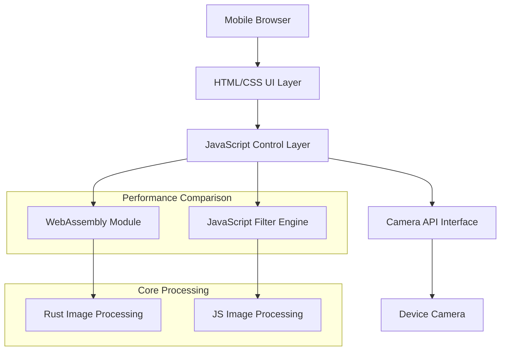

# 設計書

## 概要

WebAssembly技術を活用したリアルタイムカメラフィルタアプリケーションの技術設計書です。Rust言語でWebAssemblyモジュールを開発し、モバイルブラウザで高性能な画像処理を実現します。JavaScript版との性能比較機能も含め、WebAssemblyの優位性を実証できるシステムを構築します。

## アーキテクチャ

### システム全体構成



### レイヤー構成

#### 1. プレゼンテーション層
- **HTML/CSS UI Layer**: モバイル最適化されたユーザーインターフェース
- **レスポンシブデザイン**: iPhone/Android対応
- **タッチ操作**: スワイプ・タップ操作対応

#### 2. 制御層
- **JavaScript Control Layer**: アプリケーション制御とイベント処理
- **Camera API Interface**: WebRTC APIを使用したカメラアクセス
- **Performance Monitor**: FPS測定と比較表示

#### 3. 処理層
- **WebAssembly Module**: Rust実装の高速画像処理
- **JavaScript Filter Engine**: 比較用JavaScript実装
- **Filter Pipeline**: エフェクト処理パイプライン

## コンポーネントとインターフェース

### WebAssemblyモジュール (Rust)

```rust
// 主要なエクスポート関数
#[wasm_bindgen]
pub struct ImageProcessor {
    width: u32,
    height: u32,
}

#[wasm_bindgen]
impl ImageProcessor {
    #[wasm_bindgen(constructor)]
    pub fn new(width: u32, height: u32) -> ImageProcessor;
    
    pub fn gaussian_blur(&mut self, data: &mut [u8], radius: f32);
    pub fn edge_detection(&mut self, data: &mut [u8]);
    pub fn sepia_tone(&mut self, data: &mut [u8]);
    pub fn negative(&mut self, data: &mut [u8]);
    pub fn sharpen(&mut self, data: &mut [u8]);
}
```

### JavaScriptインターフェース

```javascript
// カメラ制御インターフェース
class CameraController {
    async initCamera(constraints);
    startStream();
    stopStream();
    captureFrame();
}

// フィルタエンジンインターフェース
class FilterEngine {
    constructor(useWasm = true);
    applyFilter(imageData, filterType);
    measurePerformance();
}

// UI制御インターフェース
class UIController {
    initMobileUI();
    handleFilterSelection();
    displayPerformanceMetrics();
    saveImage();
}
```

### パフォーマンス比較システム

```javascript
class PerformanceComparator {
    constructor() {
        this.wasmEngine = new FilterEngine(true);
        this.jsEngine = new FilterEngine(false);
        this.metrics = {
            wasmFPS: 0,
            jsFPS: 0,
            speedRatio: 0
        };
    }
    
    async comparePerformance(imageData, filterType);
    displayComparison();
}
```

## データモデル

### 画像データ構造

```typescript
interface ImageFrame {
    data: Uint8ClampedArray;  // RGBA画像データ
    width: number;            // 画像幅
    height: number;           // 画像高さ
    timestamp: number;        // フレームタイムスタンプ
}

interface FilterConfig {
    type: FilterType;         // エフェクトタイプ
    intensity: number;        // エフェクト強度 (将来拡張用)
    enabled: boolean;         // エフェクト有効フラグ
}

enum FilterType {
    GAUSSIAN_BLUR = 0,
    EDGE_DETECTION = 1,
    SEPIA_TONE = 2,
    NEGATIVE = 3,
    SHARPEN = 4
}
```

### パフォーマンスメトリクス

```typescript
interface PerformanceMetrics {
    fps: number;              // フレームレート
    processingTime: number;   // 処理時間 (ms)
    memoryUsage: number;      // メモリ使用量
    frameCount: number;       // 処理フレーム数
}

interface ComparisonResult {
    wasmMetrics: PerformanceMetrics;
    jsMetrics: PerformanceMetrics;
    speedRatio: number;       // WASM/JS速度比
    recommendation: string;   // 推奨実装
}
```

## 正確性プロパティ

*プロパティとは、システムの全ての有効な実行において真であるべき特性や動作の形式的な記述です。プロパティは人間が読める仕様と機械で検証可能な正確性保証の橋渡しとなります。*

### プロパティ1: モバイルレスポンシブ表示
*任意の*画面サイズにおいて、UIレイアウトが適切に調整され、全ての操作要素がアクセス可能であること
**検証対象: 要件1.1**

### プロパティ2: カメラストリーム取得
*任意の*カメラアクセス許可後、映像ストリームが正常に取得され、連続的なフレーム更新が行われること
**検証対象: 要件1.3**

### プロパティ3: リアルタイムエフェクト適用
*任意の*映像フレームに対して、選択されたエフェクトがリアルタイムで適用され、視覚的変化が確認できること
**検証対象: 要件2.1**

### プロパティ4: 性能基準維持
*任意の*エフェクト処理において、WebAssembly実装が45FPS以上の処理速度を維持すること
**検証対象: 要件2.2**

### プロパティ5: エフェクト処理正確性
*任意の*画像データに対して、ガウシアンブラーエフェクトが数学的に正しいぼかし効果を適用すること
**検証対象: 要件3.2**

### プロパティ6: 画像キャプチャ整合性
*任意の*キャプチャ操作において、表示中のエフェクト適用済み画像と保存される画像が同一であること
**検証対象: 要件5.1**

### プロパティ7: 性能比較正確性
*任意の*同一画像データに対して、WebAssembly版がJavaScript版の3倍以上の処理速度を達成すること
**検証対象: 要件7.1**

### プロパティ8: JavaScript実装同等性
*任意の*画像データに対して、JavaScript版とWebAssembly版のガウシアンブラーが視覚的に同等の結果を生成すること
**検証対象: 要件8.2**

## エラーハンドリング

### カメラアクセスエラー

```javascript
class CameraErrorHandler {
    handlePermissionDenied() {
        // カメラアクセス拒否時の処理
        this.showErrorMessage("カメラアクセスが必要です");
        this.showFallbackUI();
    }
    
    handleDeviceNotFound() {
        // カメラデバイス未検出時の処理
        this.showErrorMessage("カメラが見つかりません");
    }
    
    handleStreamError(error) {
        // ストリーミングエラー時の処理
        console.error("Camera stream error:", error);
        this.attemptReconnection();
    }
}
```

### WebAssemblyロードエラー

```javascript
class WasmErrorHandler {
    async handleLoadFailure() {
        // WASM読み込み失敗時のフォールバック
        console.warn("WebAssembly load failed, falling back to JavaScript");
        return new FilterEngine(false); // JavaScript版を使用
    }
    
    handleMemoryError() {
        // メモリ不足エラー時の処理
        this.reduceImageQuality();
        this.showPerformanceWarning();
    }
}
```

### パフォーマンス劣化対応

```javascript
class PerformanceManager {
    monitorFPS() {
        if (this.currentFPS < 30) {
            this.adaptiveQualityReduction();
        }
    }
    
    adaptiveQualityReduction() {
        // 画質を下げて性能を維持
        this.reduceResolution();
        this.simplifyEffects();
    }
}
```

## テスト戦略

### 単体テスト

**Rustモジュールテスト**:
- 各エフェクト関数の数学的正確性
- メモリ安全性の検証
- 境界値テスト

**JavaScriptモジュールテスト**:
- カメラAPI統合テスト
- UI操作レスポンステスト
- エラーハンドリングテスト

### プロパティベーステスト

**使用ライブラリ**: `quickcheck` (Rust), `fast-check` (JavaScript)

**テスト設定**: 各プロパティテストで最低100回の反復実行

**プロパティテスト実装例**:

```rust
#[cfg(test)]
mod tests {
    use quickcheck::quickcheck;
    
    // **Feature: wasm-camera-filter, Property 5: エフェクト処理正確性**
    quickcheck! {
        fn gaussian_blur_preserves_image_bounds(data: Vec<u8>) -> bool {
            let mut processor = ImageProcessor::new(100, 100);
            let mut test_data = data.clone();
            processor.gaussian_blur(&mut test_data, 2.0);
            
            // ぼかし処理後も画像データサイズが保持される
            test_data.len() == data.len()
        }
    }
}
```

### 統合テスト

**ブラウザ自動化テスト**:
- Playwright/Puppeteerを使用
- 実際のカメラデバイスシミュレーション
- モバイルブラウザエミュレーション

**パフォーマンステスト**:
- 連続処理での安定性確認
- メモリリーク検出
- FPS測定の自動化

### デバイステスト

**対象デバイス**:
- iPhone (iOS 11.3+)
- Android (Chrome 67+)
- デスクトップブラウザ

**テスト項目**:
- カメラアクセス動作
- タッチ操作レスポンス
- 画像保存機能
- 性能ベンチマーク