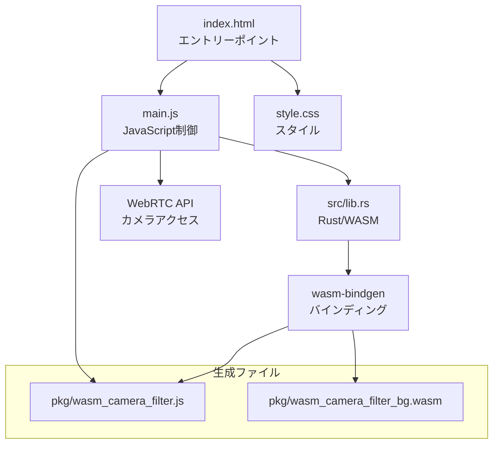

# 📸 WebAssembly カメラフィルタ - 技術解説

## 🎯 プロジェクト概要

このプロジェクトは、**WebAssembly (WASM)**とJavaScriptの性能比較を目的としたリアルタイムカメラフィルタアプリケーションです。

> **学習ポイント:**
> - WebAssemblyとJavaScriptの連携方法
> - Rustで書いたコードをWebブラウザで実行する仕組み
> - リアルタイム画像処理の実装
> - WebRTC APIを使ったカメラアクセス

## 🏗️ システムアーキテクチャ

### 主要コンポーネント

- **index.html**: UIとDOM構造の定義
- **main.js**: アプリケーションロジックとWASM連携
- **src/lib.rs**: Rustで実装された高速画像処理
- **pkg/**: wasm-packで生成されたWebAssemblyモジュール

## 📚 詳細ドキュメント

- [実行フロー詳解](execution-flow.md) - HTMLエントリーからエフェクト処理まで
- [WebAssembly実装ガイド](webassembly-guide.md) - Rust + wasm-bindgen の詳細
- [性能比較と最適化](performance-analysis.md) - 実測データと最適化ポイント

---

**作成者**: [unafi](https://github.com/unafi)  
**技術**: WebAssembly, Rust, JavaScript, WebRTC