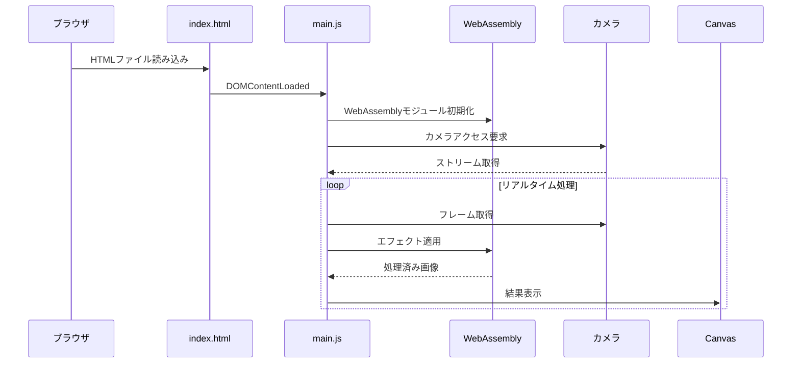
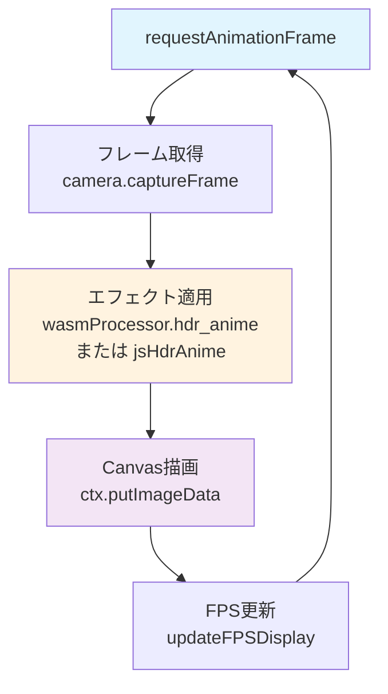

# 🔄 実行フロー詳解

このページでは、ブラウザでindex.htmlを開いてから、カメラアクセス許可を経て、エフェクト処理が実行されるまでの詳細な流れを、実際のコード断片と共に解説します。

## 📋 実行シーケンス概要



## ステップ1: HTMLエントリーポイント

**ブラウザがindex.htmlを読み込み**

📄 **index.html (最下部)**
```html
<!-- JavaScriptモジュール読み込み -->
<script type="module" src="main.js"></script>
</body>
</html>
```

**解説:** HTMLが読み込まれると、DOMContentLoadedイベントが発火し、main.jsのモジュールが実行されます。

## ステップ2: アプリケーション初期化開始

**DOMContentLoadedイベントでアプリ開始**

📄 **main.js (最下部)**
```javascript
// アプリケーション開始
document.addEventListener('DOMContentLoaded', async () => {
    const app = new CameraFilterApp();
    await app.init();
});
```

**解説:** DOMが完全に読み込まれた後、CameraFilterAppクラスのインスタンスを作成し、初期化を開始します。

## ステップ3: WebAssemblyモジュール初期化

**WebAssemblyモジュールの読み込みと初期化**

📄 **main.js - CameraFilterApp.init()**
```javascript
async init() {
    try {
        console.log('WebAssemblyモジュールを初期化中...');
        await init(); // WebAssemblyモジュール初期化
        
        // WebAssemblyプロセッサを初期化
        const processor = new ImageProcessor(640, 480);
        this.wasmEngine.setWasmProcessor(processor);
        
        console.log('WebAssembly初期化完了');
        
        // DOM要素を取得
        this.setupDOM();
        
        // イベントリスナーを設定
        this.setupEventListeners();
        
        // カメラを初期化
        await this.initCamera();
        
    } catch (error) {
        console.error('初期化エラー:', error);
        this.camera.showError('アプリケーションの初期化に失敗しました');
    }
}
```

> **重要:** `await init()`でWebAssemblyモジュール（pkg/wasm_camera_filter.js）を非同期で読み込みます。この時点でRustで書いたコードがブラウザで実行可能になります。

## ステップ4: DOM要素とイベントリスナー設定

**UI要素の取得とイベント設定**

📄 **main.js - setupEventListeners()**
```javascript
setupEventListeners() {
    // エフェクトボタン
    document.querySelectorAll('.effect-btn').forEach(btn => {
        btn.addEventListener('click', (e) => {
            const effect = parseInt(e.target.dataset.effect);
            this.setEffect(effect);
            
            // アクティブ状態を更新
            document.querySelectorAll('.effect-btn').forEach(b => b.classList.remove('active'));
            e.target.classList.add('active');
        });
    });

    // エンジン切り替えボタン
    document.getElementById('wasm-engine').addEventListener('click', () => {
        this.switchEngine(true);
    });
    
    document.getElementById('js-engine').addEventListener('click', () => {
        this.switchEngine(false);
    });
    
    // その他のボタンイベント...
}
```

**解説:** エフェクト選択ボタン、エンジン切り替えボタン、撮影ボタンなどのイベントリスナーを設定します。

## ステップ5: カメラアクセス要求

**WebRTC APIでカメラアクセス許可を要求**

📄 **main.js - CameraController.initCamera()**
```javascript
async initCamera(videoElement) {
    this.video = videoElement;
    
    try {
        console.log('カメラアクセスを要求中...');
        
        // カメラ制約設定（モバイル最適化）
        const constraints = {
            video: {
                facingMode: this.currentFacingMode, // 'environment' = バックカメラ
                width: { ideal: 640, max: 1280 },
                height: { ideal: 480, max: 720 },
                frameRate: { ideal: 30, max: 60 }
            },
            audio: false
        };

        this.stream = await navigator.mediaDevices.getUserMedia(constraints);
        this.video.srcObject = this.stream;
        
        console.log('カメラアクセス成功');
        return true;
        
    } catch (error) {
        console.error('カメラアクセスエラー:', error);
        this.handleCameraError(error);
        return false;
    }
}
```

> **ユーザー体験:** この時点でブラウザがカメラアクセス許可ダイアログを表示します。ユーザーが「許可」をクリックすると、カメラストリームが取得されます。

## ステップ6: リアルタイム画像処理開始

**requestAnimationFrameによる連続処理開始**

📄 **main.js - startProcessing()**
```javascript
startProcessing() {
    if (this.isProcessing) {
        console.log('既に処理中です');
        return;
    }
    
    this.isProcessing = true;
    console.log('リアルタイム画像処理を開始');
    
    const processFrame = () => {
        if (!this.isProcessing) {
            console.log('処理が停止されました');
            return;
        }
        
        try {
            // フレームをキャプチャ
            const imageData = this.camera.captureFrame(this.canvas);
            
            if (imageData && imageData.data.length > 0) {
                // WebAssemblyプロセッサのサイズを更新
                if (this.wasmEngine.wasmProcessor) {
                    const { width, height } = imageData;
                    if (this.wasmEngine.wasmProcessor.width !== width || 
                        this.wasmEngine.wasmProcessor.height !== height) {
                        console.log(`画像サイズ変更: ${width}x${height}`);
                        this.wasmEngine.wasmProcessor = new ImageProcessor(width, height);
                    }
                }
                
                // フィルタを適用
                this.currentEngine.applyFilter(imageData);
                
                // 結果を表示
                this.ctx.putImageData(imageData, 0, 0);
                
                // FPS表示を更新
                this.updateFPSDisplay();
            }
        } catch (error) {
            console.error('フレーム処理エラー:', error);
        }
        
        this.animationId = requestAnimationFrame(processFrame);
    };
    
    processFrame();
}
```

**解説:** `requestAnimationFrame`を使って、ブラウザのリフレッシュレートに同期した連続処理を開始します。通常60FPSで実行されます。

## ステップ7: エフェクト処理実行

**WebAssemblyまたはJavaScriptでエフェクト適用**

📄 **main.js - FilterEngine.applyWasmFilter()**
```javascript
applyWasmFilter(imageData) {
    const { width, height, data } = imageData;
    
    // WebAssemblyプロセッサのサイズを更新
    if (this.wasmProcessor.width !== width || this.wasmProcessor.height !== height) {
        this.wasmProcessor = new ImageProcessor(width, height);
    }
    
    switch (this.currentEffect) {
        case 0: // HDRアニメ調
            this.wasmProcessor.hdr_anime(data);
            break;
        case 1: // ガウシアンブラー
            this.wasmProcessor.gaussian_blur(data, 3.0);
            break;
        case 2: // エッジ検出
            this.wasmProcessor.edge_detection(data);
            break;
        case 3: // セピア調
            this.wasmProcessor.sepia_tone(data);
            break;
        case 4: // ネガフィルム
            this.wasmProcessor.negative(data);
            break;
        case 5: // シャープネス
            this.wasmProcessor.sharpen(data);
            break;
    }
}
```

📄 **src/lib.rs - hdr_anime() (WebAssembly側)**
```rust
/// HDRアニメ調エフェクトを適用
pub fn hdr_anime(&mut self, data: &mut [u8]) {
    console_log!("Applying HDR anime effect");
    
    let width = self.width as usize;
    let height = self.height as usize;
    
    // ステップ1: HDR強調処理
    self.apply_hdr_enhancement(data, width, height);
    
    // ステップ2: アニメ調処理（色の階調化）
    self.apply_anime_posterization(data, width, height);
    
    // ステップ3: エッジ強調
    self.apply_edge_enhancement(data, width, height);
}
```

> **重要:** この時点で、JavaScriptからRustで書かれたWebAssembly関数を呼び出しています。画像データ（Uint8ClampedArray）がWebAssemblyメモリ空間で高速処理されます。

## ステップ8: 結果表示とFPS測定

**処理結果をCanvasに描画し、性能を測定**

📄 **main.js - updateFPSDisplay()**
```javascript
updateFPSDisplay() {
    const wasmFPS = this.wasmEngine.getFPS();
    const jsFPS = this.jsEngine.getFPS();
    const currentFPS = this.currentEngine.getFPS();
    
    document.getElementById('fps-display').textContent = `FPS: ${currentFPS}`;
    document.getElementById('wasm-fps').textContent = wasmFPS || '--';
    document.getElementById('js-fps').textContent = jsFPS || '--';
    
    // 速度比を計算
    if (wasmFPS > 0 && jsFPS > 0) {
        const ratio = (wasmFPS / jsFPS).toFixed(1);
        document.getElementById('speed-ratio').textContent = `${ratio}x`;
    }
}
```

**解説:** 処理された画像データをCanvasに描画し、同時にFPSを測定・表示します。WebAssemblyとJavaScriptの性能差がリアルタイムで確認できます。

## 🔄 継続的な処理ループ



> **ループ処理:** ステップ6〜8が`requestAnimationFrame`によって継続的に実行され、リアルタイムなカメラフィルタ効果を実現しています。

---

[← 技術解説トップに戻る](README.md)