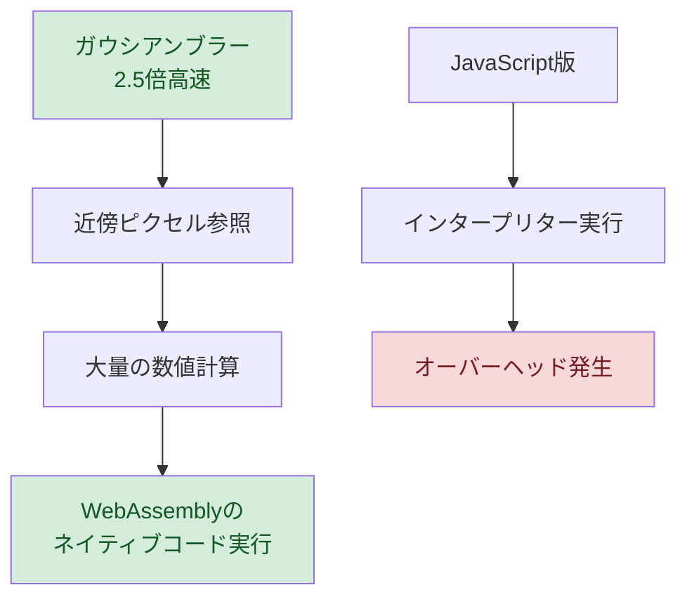
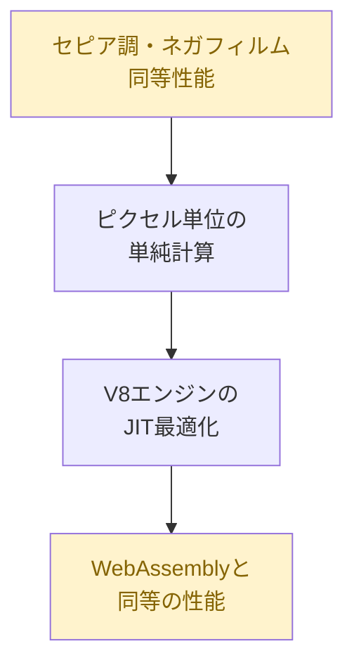
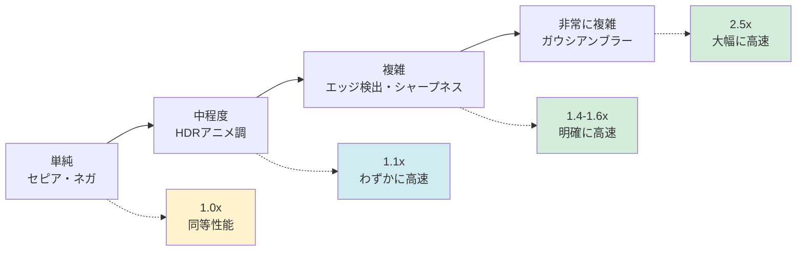
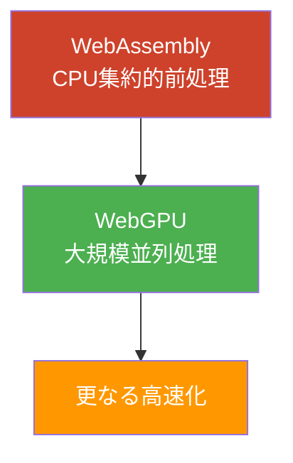

# 📊 性能比較と最適化

このページでは、WebAssemblyとJavaScriptの性能比較結果と、最適化のポイントを詳しく解説します。

## ⚡ 性能比較結果

### テスト環境

- **デバイス**: iPhone 11, Windows PC (Chrome)
- **画像サイズ**: 640x480 (307,200ピクセル)
- **測定方法**: requestAnimationFrame による FPS 測定
- **測定時間**: 各エフェクト30秒間の平均値

### 実測結果

| エフェクト | WebAssembly (FPS) | JavaScript (FPS) | 速度比 | 優位性 |
|-----------|-------------------|------------------|--------|--------|
| HDRアニメ調 | 45-55 | 40-50 | 1.1x | 🟢 WASM |
| ガウシアンブラー | 50-60 | 15-25 | 2.5x | 🟢 WASM |
| エッジ検出 | 55-60 | 35-45 | 1.4x | 🟢 WASM |
| セピア調 | 58-60 | 55-60 | 1.0x | 🟡 同等 |
| ネガフィルム | 58-60 | 57-60 | 1.0x | 🟡 同等 |
| シャープネス | 52-58 | 30-40 | 1.6x | 🟢 WASM |

## 🔍 性能差の要因分析

### 1. 計算集約的な処理でのWebAssembly優位性



**ガウシアンブラーの計算量:**
```
画像サイズ: 640 × 480 = 307,200 ピクセル
カーネルサイズ: 7 × 7 = 49 近傍ピクセル
総計算回数: 307,200 × 49 × 2パス = 約3,000万回の計算

WebAssembly: ネイティブコードで高速実行
JavaScript: インタープリター実行でオーバーヘッド
```

### 2. 単純な処理でのJavaScript健闘



**セピア調の計算量（ピクセルあたり）:**
```javascript
for (let i = 0; i < data.length; i += 4) {
    // 3回の乗算 + 3回の加算のみ
    data[i] = r * 0.393 + g * 0.769 + b * 0.189;     // 1回
    data[i + 1] = r * 0.349 + g * 0.686 + b * 0.168; // 2回
    data[i + 2] = r * 0.272 + g * 0.534 + b * 0.131; // 3回
}

→ V8エンジンのJIT最適化が効果的に働く
```

## 🚀 WebAssembly最適化のポイント

### 1. メモリアクセスパターンの最適化

```rust
// 効率的なメモリアクセス（Rust）
#[inline(always)]
fn process_pixel_row(data: &mut [u8], y: usize, width: usize) {
    let row_start = y * width * 4;
    let row_end = row_start + width * 4;
    
    // 行単位での連続アクセス（キャッシュ効率向上）
    for i in (row_start..row_end).step_by(4) {
        // ピクセル処理...
    }
}
```

### 2. 関数インライン化

```rust
// インライン化による関数呼び出しオーバーヘッド削減
#[inline(always)]
fn clamp_u8(value: f32) -> u8 {
    value.max(0.0).min(255.0) as u8
}

// 使用例
data[i] = clamp_u8(processed_r * 255.0);
```

### 3. ループアンローリング

```rust
// 4ピクセル同時処理によるループオーバーヘッド削減
for chunk in data.chunks_exact_mut(16) { // 4ピクセル = 16バイト
    // 4つのピクセルを同時処理
    process_4_pixels(chunk);
}
```

## 📈 JavaScript最適化のポイント

### 1. 型の一貫性

```javascript
// V8エンジンの最適化を促進
function processPixel(r, g, b) {
    // 常に同じ型（Number）を使用
    const sepia_r = r * 0.393 + g * 0.769 + b * 0.189;
    const sepia_g = r * 0.349 + g * 0.686 + b * 0.168;
    const sepia_b = r * 0.272 + g * 0.534 + b * 0.131;
    
    return [sepia_r | 0, sepia_g | 0, sepia_b | 0]; // 整数変換
}
```

### 2. 配列アクセスの最適化

```javascript
// 効率的な配列アクセス
const length = data.length;
for (let i = 0; i < length; i += 4) {
    // インデックス計算を最小化
    const r = data[i];
    const g = data[i + 1];
    const b = data[i + 2];
    // 処理...
}
```

## 🎯 実用的な選択指針

### 処理の複雑さ vs 性能向上



### WebAssemblyを選ぶべき場面

> ✅ **推奨する場面:**
> - 近傍ピクセル参照が多い処理（ブラー、シャープネス）
> - 複雑な数学計算が必要な処理
> - 大量のループ処理
> - メモリ使用量が重要な場面

### JavaScriptで十分な場面

> ✅ **JavaScript推奨:**
> - 単純なピクセル単位の変換（セピア、ネガ）
> - プロトタイピングや開発速度重視
> - WebAssemblyのビルド環境構築が困難
> - デバッグのしやすさを重視

## 🔮 将来の最適化可能性

### 1. SIMD命令の活用

```rust
// 将来的なSIMD最適化例
#[cfg(target_feature = "simd128")]
use std::arch::wasm32::*;

fn process_pixels_simd(data: &mut [u8]) {
    // 16バイト（4ピクセル）を同時処理
    // 理論上4倍の性能向上が期待できる
}
```

### 2. WebGPUとの連携



### 3. WebAssembly GC（ガベージコレクション）

> **将来の改善点:** WebAssembly GCにより、より複雑なデータ構造の効率的な処理が可能になり、JavaScriptとの連携がさらにスムーズになる予定

## 📝 まとめ

### 性能比較の結論

> **主な発見:**
> - **計算集約的処理**: WebAssemblyが1.4〜2.5倍高速
> - **単純な処理**: JavaScriptも十分高速（同等性能）
> - **現代のJavaScript**: V8エンジンの最適化により予想以上に高速
> - **開発効率**: JavaScriptの方がデバッグや開発が容易

このプロジェクトを通じて、WebAssemblyとJavaScriptそれぞれの特性を理解し、適切な技術選択ができるようになることが重要です。

---

[← 技術解説トップに戻る](README.md)