# ⚡ WebAssembly実装ガイド

このページでは、RustでWebAssemblyモジュールを作成し、JavaScriptから呼び出す具体的な実装方法を詳しく解説します。

## 🦀 Rustプロジェクト設定

### Cargo.toml設定

📄 **Cargo.toml**
```toml
[package]
name = "wasm-camera-filter"
version = "0.1.0"
edition = "2021"

[lib]
crate-type = ["cdylib"]  # WebAssembly用の動的ライブラリとして出力

[dependencies]
wasm-bindgen = "0.2"     # JavaScriptとRustの橋渡し

[dependencies.web-sys]
version = "0.3"
features = [
  "console",             # console.log() 使用のため
]
```

> **重要設定:**
> - `crate-type = ["cdylib"]`: WebAssembly用の動的ライブラリを生成
> - `wasm-bindgen`: RustとJavaScript間のバインディング
> - `web-sys`: Web API（console.logなど）へのアクセス

## 🔧 wasm-bindgenによるバインディング

### 基本的な構造体とメソッド

📄 **src/lib.rs**
```rust
use wasm_bindgen::prelude::*;

// WebAssembly用のコンソール出力設定
#[wasm_bindgen]
extern "C" {
    #[wasm_bindgen(js_namespace = console)]
    fn log(s: &str);
}

// デバッグ用マクロ
macro_rules! console_log {
    ($($t:tt)*) => (log(&format_args!($($t)*).to_string()))
}

/// WebAssembly画像処理エンジン
#[wasm_bindgen]
pub struct ImageProcessor {
    width: u32,
    height: u32,
}

#[wasm_bindgen]
impl ImageProcessor {
    /// 新しいImageProcessorインスタンスを作成
    #[wasm_bindgen(constructor)]
    pub fn new(width: u32, height: u32) -> ImageProcessor {
        console_log!("ImageProcessor initialized: {}x{}", width, height);
        ImageProcessor { width, height }
    }
}
```

> **wasm-bindgenの役割:**
> - `#[wasm_bindgen]`: 構造体やメソッドをJavaScriptから呼び出し可能にする
> - `#[wasm_bindgen(constructor)]`: JavaScriptの`new`演算子で呼び出し可能
> - `extern "C"`: JavaScript関数をRustから呼び出し可能にする

## 🎨 画像処理メソッドの実装

### HDRアニメ調エフェクト

📄 **src/lib.rs - hdr_anime()**
```rust
/// HDRアニメ調エフェクトを適用
pub fn hdr_anime(&mut self, data: &mut [u8]) {
    console_log!("Applying HDR anime effect");
    
    let width = self.width as usize;
    let height = self.height as usize;
    
    // ステップ1: HDR強調処理
    self.apply_hdr_enhancement(data, width, height);
    
    // ステップ2: アニメ調処理（色の階調化）
    self.apply_anime_posterization(data, width, height);
    
    // ステップ3: エッジ強調
    self.apply_edge_enhancement(data, width, height);
}

/// HDR強調処理を適用
fn apply_hdr_enhancement(&self, data: &mut [u8], width: usize, height: usize) {
    for i in (0..data.len()).step_by(4) {
        let r = data[i] as f32 / 255.0;
        let g = data[i + 1] as f32 / 255.0;
        let b = data[i + 2] as f32 / 255.0;

        // ガンマ補正（コントラスト強化）
        let gamma = 0.7;
        let enhanced_r = r.powf(gamma);
        let enhanced_g = g.powf(gamma);
        let enhanced_b = b.powf(gamma);

        // 彩度向上
        let saturation_boost = 1.8;
        let gray = enhanced_r * 0.299 + enhanced_g * 0.587 + enhanced_b * 0.114;
        
        let final_r = gray + (enhanced_r - gray) * saturation_boost;
        let final_g = gray + (enhanced_g - gray) * saturation_boost;
        let final_b = gray + (enhanced_b - gray) * saturation_boost;

        data[i] = (final_r * 255.0).max(0.0).min(255.0) as u8;
        data[i + 1] = (final_g * 255.0).max(0.0).min(255.0) as u8;
        data[i + 2] = (final_b * 255.0).max(0.0).min(255.0) as u8;
    }
}
```

> **Rustの利点:**
> - **メモリ安全性**: バッファオーバーフローなどのメモリエラーを防止
> - **ゼロコスト抽象化**: 高レベルなコードでも高速実行
> - **型安全性**: コンパイル時に多くのエラーを検出

## 🔄 JavaScriptとの連携

### WebAssemblyモジュールの読み込み

📄 **main.js**
```javascript
import init, { ImageProcessor } from './pkg/wasm_camera_filter.js';

class CameraFilterApp {
    async init() {
        try {
            // WebAssemblyモジュール初期化
            await init();
            
            // ImageProcessorインスタンス作成
            const processor = new ImageProcessor(640, 480);
            this.wasmEngine.setWasmProcessor(processor);
            
            console.log('WebAssembly初期化完了');
        } catch (error) {
            console.error('WebAssembly初期化エラー:', error);
        }
    }
}
```

### WebAssembly関数の呼び出し

📄 **main.js - applyWasmFilter()**
```javascript
applyWasmFilter(imageData) {
    const { width, height, data } = imageData;
    
    // WebAssemblyプロセッサのサイズを更新
    if (this.wasmProcessor.width !== width || this.wasmProcessor.height !== height) {
        this.wasmProcessor = new ImageProcessor(width, height);
    }
    
    switch (this.currentEffect) {
        case 0: // HDRアニメ調
            this.wasmProcessor.hdr_anime(data);  // ← Rust関数を呼び出し
            break;
        case 1: // ガウシアンブラー
            this.wasmProcessor.gaussian_blur(data, 3.0);
            break;
        // その他のエフェクト...
    }
}
```

## 🏗️ ビルドプロセス

### wasm-packによるビルドフロー

```mermaid
flowchart TD
    A[Rust Source Code<br/>src/lib.rs] --> B[rustc + wasm32-unknown-unknown]
    B --> C[WebAssembly Binary<br/>.wasm]
    C --> D[wasm-bindgen]
    D --> E[JavaScript Bindings<br/>.js]
    E --> F[wasm-pack]
    F --> G[pkg/ ディレクトリ]
    
    G --> H[wasm_camera_filter.js<br/>JavaScript バインディング]
    G --> I[wasm_camera_filter_bg.wasm<br/>WebAssembly バイナリ]
    G --> J[wasm_camera_filter.d.ts<br/>TypeScript 型定義]
    G --> K[package.json<br/>NPM パッケージ情報]
    
    style A fill:#ce422b,color:#fff
    style C fill:#654ff0,color:#fff
    style E fill:#f7df1e
    style G fill:#e8f5e8
```



### ビルドコマンド

```bash
# WebAssemblyモジュールをビルド
wasm-pack build --target web --out-dir pkg

# 生成されるファイル:
# - pkg/wasm_camera_filter.js      (JavaScriptバインディング)
# - pkg/wasm_camera_filter_bg.wasm (WebAssemblyバイナリ)
# - pkg/wasm_camera_filter.d.ts    (TypeScript型定義)
```

## 💾 メモリ管理と最適化

### WebAssemblyメモリ空間

```mermaid
graph LR
    subgraph "JavaScript Heap"
        A[ImageData]
        B[Uint8Array<br/>[R,G,B,A,<br/>R,G,B,A,<br/>...]]
    end
    
    subgraph "WebAssembly Linear Memory"
        C[Rust Variables]
        D[&mut u8 data]
        E[width: usize]
        F[height: usize]
    end
    
    A --> B
    B -.->|ゼロコピー| D
    C --> D
    C --> E
    C --> F
    
    style A fill:#e3f2fd
    style B fill:#fff3e0
    style C fill:#f3e5f5
    style D fill:#e8f5e8
```

> **メモリ効率:**
> - **ゼロコピー**: JavaScriptとWebAssembly間でデータをコピーせずに共有
> - **線形メモリ**: WebAssemblyの連続メモリ空間で高速アクセス
> - **自動管理**: Rustの所有権システムによる安全なメモリ管理

## 🚀 性能最適化のポイント

### 1. SIMD命令の活用

```rust
// 将来的な最適化例（SIMD使用）
#[cfg(target_arch = "wasm32")]
use std::arch::wasm32::*;

// 4つのピクセルを同時処理
fn process_pixels_simd(data: &mut [u8]) {
    // SIMD命令を使った並列処理
    // 実装は複雑になるが、大幅な性能向上が期待できる
}
```

### 2. メモリアクセスパターンの最適化

```rust
// 効率的なメモリアクセス
for y in 0..height {
    for x in 0..width {
        let idx = (y * width + x) * 4;  // 連続アクセス
        // ピクセル処理...
    }
}
```

### 3. 関数インライン化

```rust
#[inline(always)]
fn get_pixel_index(x: usize, y: usize, width: usize) -> usize {
    (y * width + x) * 4
}
```

## 🔍 デバッグとプロファイリング

### コンソール出力

```rust
// Rustからブラウザのコンソールに出力
console_log!("Processing image: {}x{}", width, height);
console_log!("Effect applied: {}", effect_name);
```

### パフォーマンス測定

```javascript
// JavaScript側でのパフォーマンス測定
const startTime = performance.now();
this.wasmProcessor.hdr_anime(data);
const endTime = performance.now();
console.log(`WASM処理時間: ${endTime - startTime}ms`);
```

---

[← 技術解説トップに戻る](README.md)